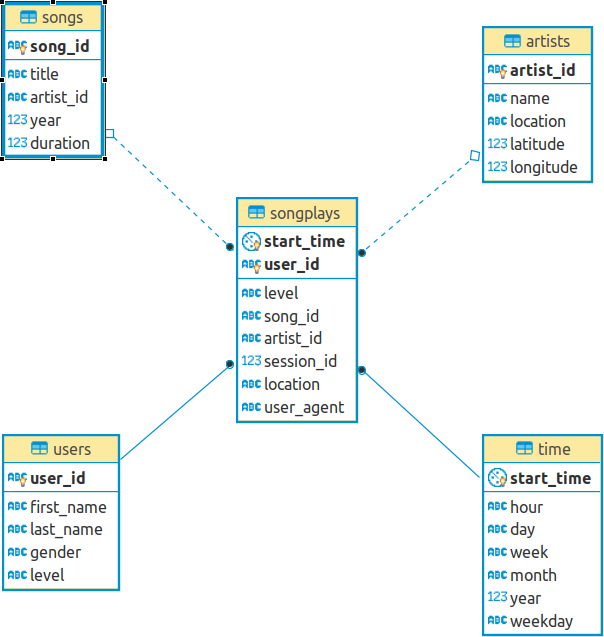

# Data Modelling With Postgres

## Introduction

A startup called Sparkify wants to analyze the data they've been collecting on songs and user activity on their new music streaming app. The analytics team is particularly interested in understanding what songs users are listening to. Currently, they don't have an easy way to query their data, which resides in a directory of JSON logs on user activity on the app, as well as a directory with JSON metadata on the songs in their app.

## Data Warehouse Description



The data warehouse is set up using the star schema.  This has several advantages:

- Good performance. This is because it is a small number of tables with clear join paths.  This results in two benefits:
  - Queries run faster
  - It is easier to load large amounts of data
- It is simple to understand.  Again, this is a side effect of having one central fact table with clear join paths to the dimension tables
- Data integrity is maintained.  The relations from the fact table to the dimension table and regular foreign key constraints, which helps to maintain data integrity.

Additionally, the data warehouse allows Sparkify data analysts to easily extract information about how their users are using their service.  In this case, the main "fact" or "measure" that we care about is song plays.  These are conveniently stored in the songplays table and have a direct relation to all of the dimension table.

One can therefore easily write SQL queries that provide information on songplays paired with one or more dimensions.

Here are some examples:

#### What are 10 the most active users?

```sql
SELECT
    users.first_name AS first_name,
    users.last_name AS last_name,
    sub_query.times_played AS times_played
FROM users
LEFT JOIN LATERAL (
    SELECT
        songplays.user_id,
        count(*) AS times_played
    FROM songplays
    WHERE songplays.user_id = users.user_id
    GROUP BY songplays.user_id
) AS sub_query ON true
ORDER BY sub_query.times_played DESC
LIMIT 10;
```

This is a sample result for the above:

```sh
 first_name | last_name | times_played
------------+-----------+--------------
 Chloe      | Cuevas    |          689
 Tegan      | Levine    |          665
 Kate       | Harrell   |          557
 Lily       | Koch      |          463
 Aleena     | Kirby     |          397
 Jacqueline | Lynch     |          346
 Layla      | Griffin   |          321
 Jacob      | Klein     |          289
 Mohammad   | Rodriguez |          270
 Matthew    | Jones     |          248
(10 rows)
```

#### Which are the most popular days for song plays?

```sql
SELECT
    time.weekday,
    count(*) AS song_plays
FROM songplays
LEFT JOIN time ON songplays.start_time = time.start_time
GROUP BY time.weekday
ORDER BY song_plays DESC;
```

This would get you something like:

```sh
 weekday | song_plays
---------+--------------
 2       |         1364
 4       |         1295
 1       |         1071
 3       |         1052
 0       |         1014
 5       |          628
 6       |          396
(7 rows)
```

#### Which are the most popular days for song plays by women?

```sql
SELECT
    time.weekday,
    count(*) AS song_plays
FROM songplays
LEFT JOIN time ON songplays.start_time = time.start_time
LEFT JOIN users ON songplays.user_id = users.user_id
WHERE users.gender = 'F'
GROUP BY time.weekday
ORDER BY song_plays DESC;
```

That would get you:

```sh
 weekday | song_plays
---------+------------
 2       |       1095
 3       |        828
 4       |        819
 1       |        800
 0       |        651
 5       |        410
 6       |        284
(7 rows)
```

---

As you can see, extracting meaningful information about usage of Sparkify is now quite accessible and somewhat straight-forward.

### The tables

- songplays: his is the central fact table.  It records in log data associated with song plays.  This table has foreign key relations to each of the other tables listed below.
- users: this table stores user information
- songs: this table stores song information
- artists: this table stores artist information
- time: timestamps of records in songplays broken down into specific units

### The ETL

The module `etl.py` handles fetching and processing of song and song play data from the `data` directory.

The design of the ETL is guided by two ideas:

1. Good performance: the ETL should run reasonably fast
2. Idempotent process: if you run the ETL process multiple times over the same data, you should not get different results.

There are two main ETL processes:

#### 1. Processing songs

We go through the song_data directory and find all the JSON files, which we process individually by passing them through the `process_song_file` function in etl.py.  This function simply:

- extracts song data and stores it in the songs table
- extracts artist data and stores it in the artists table

#### 2. Processing logs

We go through the log_data directory and find all the JSON files.  We then process each file individually though the `process_log_file` function in etl.py.  This is what that function does to each log record:

- converts the timestamp to a Python datetime, and extracts hour, day, week, month, year, weekday, which are stored in the time table
- extracts user data and stores it in the users table
- extracts song play data and stores it in the songplays table

### Files in this repo

- test.ipynb displays the first few rows of each table to let you check your database.
- create_tables.py drops and creates the database tables. You run this file to reset your tables before each time you run the ETL script.
- etl.ipynb This notebook contains detailed instructions on the ETL process for each of the tables.
- etl.py reads and processes files from song_data and log_data and loads them into the database tables.
- sql_queries.py contains all the sql queries.
- README.md provides discussion on your project.
